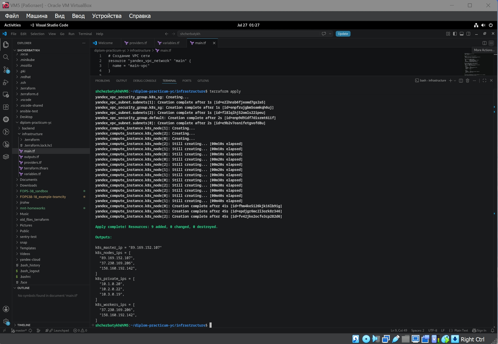
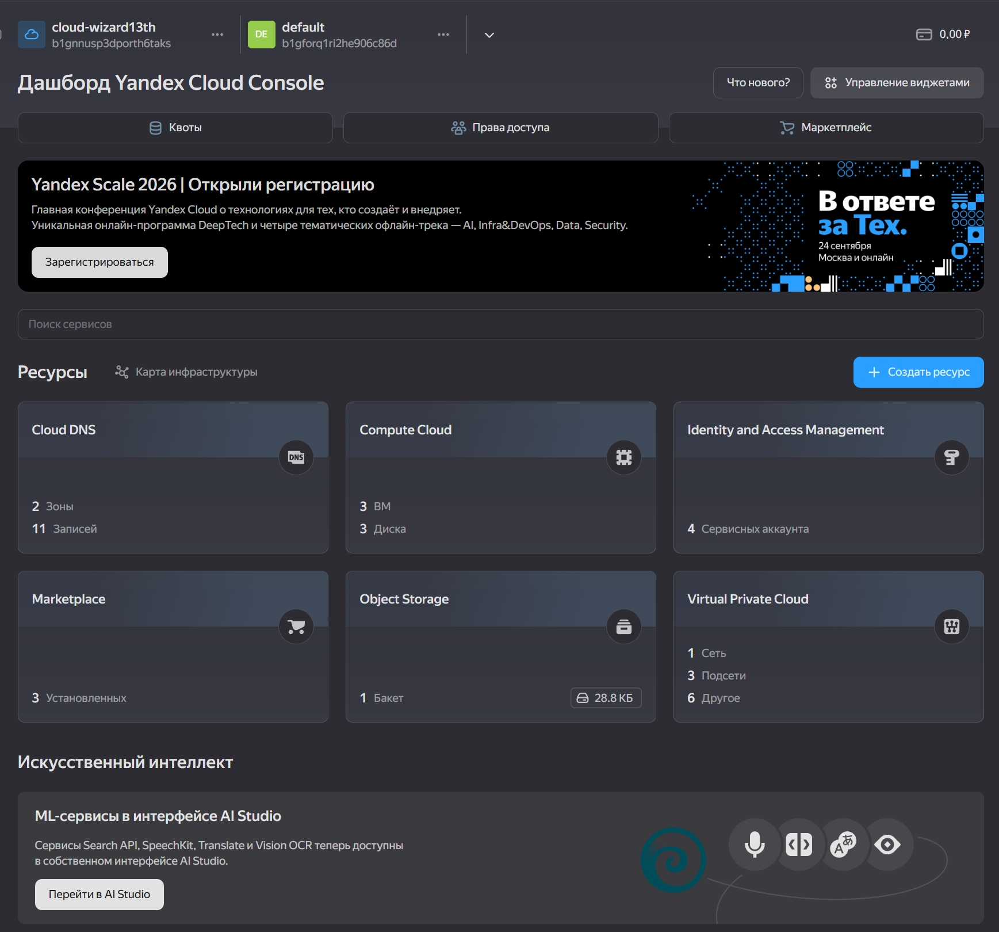
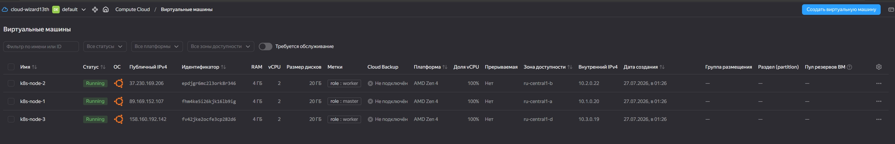
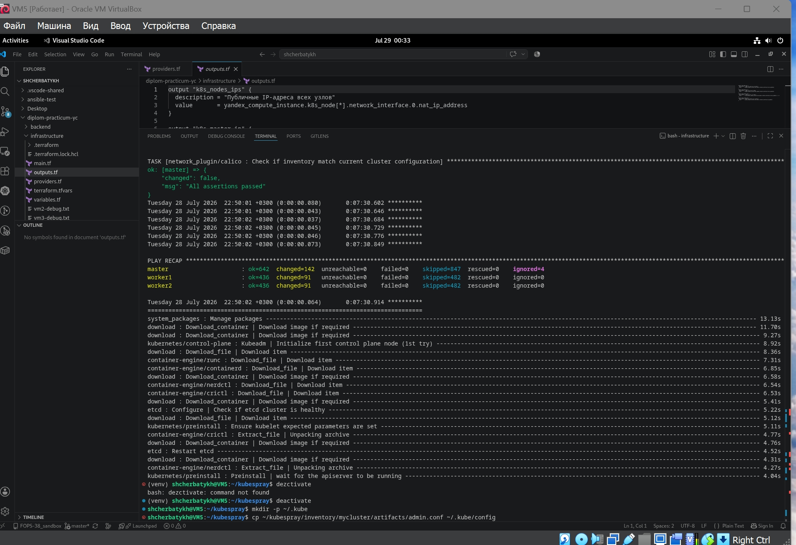
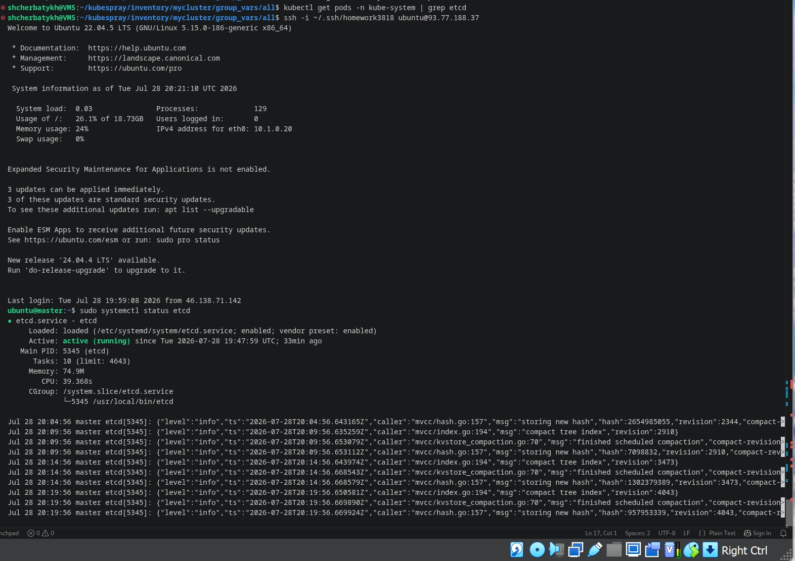
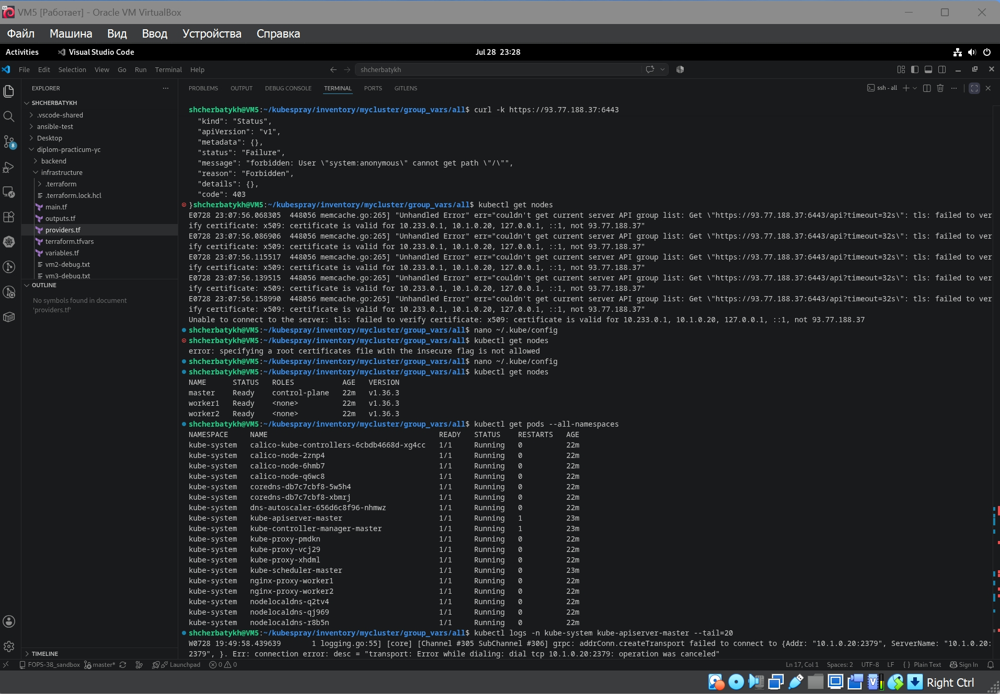

# Дипломный практикум в Yandex.Cloud (FOPS-38, Щербатых А.Е.)

---

# Цели:
1. Подготовить облачную инфраструктуру на базе облачного провайдера Яндекс.Облако.
2. Запустить и сконфигурировать Kubernetes кластер.
3. Установить и настроить систему мониторинга.
4. Настроить и автоматизировать сборку тестового приложения с использованием Docker-контейнеров.
5. Настроить CI для автоматической сборки и тестирования.
6. Настроить CD для автоматического развёртывания приложения.

---

## Этапы выполнения:
### Этап 1. Создание облачной инфраструктуры

Для начала необходимо подготовить облачную инфраструктуру в ЯО при помощи Terraform.

Особенности выполнения:

- Бюджет купона ограничен, что следует иметь в виду при проектировании инфраструктуры и использовании ресурсов; Для облачного k8s используйте региональный мастер(неотказоустойчивый). Для self-hosted k8s минимизируйте ресурсы ВМ и долю ЦПУ. В обоих вариантах используйте прерываемые ВМ для worker nodes.

Предварительная подготовка к установке и запуску Kubernetes кластера.

1. Создайте сервисный аккаунт, который будет в дальнейшем использоваться Terraform для работы с инфраструктурой с необходимыми и достаточными правами. Не стоит использовать права суперпользователя
2. Подготовьте backend для Terraform:

   а. Рекомендуемый вариант: S3 bucket в созданном ЯО аккаунте (создание бакета через TF)

   б. Альтернативный вариант: Terraform Cloud

3. Создайте конфигурацию Terrafrom, используя созданный бакет ранее как бекенд для хранения стейт файла. Конфигурации Terraform для создания сервисного аккаунта и бакета и основной инфраструктуры следует сохранить в разных папках.
4. Создайте VPC с подсетями в разных зонах доступности.
5. Убедитесь, что теперь вы можете выполнить команды terraform destroy и terraform apply без дополнительных ручных действий.
6. В случае использования Terraform Cloud в качестве backend убедитесь, что применение изменений успешно проходит, используя web-интерфейс Terraform cloud.

Ожидаемые результаты:

Terraform сконфигурирован и создание инфраструктуры посредством Terraform возможно без дополнительных ручных действий, стейт основной конфигурации сохраняется в бакете или Terraform Cloud.

Полученная конфигурация инфраструктуры является предварительной, поэтому в ходе дальнейшего выполнения задания возможны изменения.

---
### Облачная инфраструктура

Для удобства решил организовать файлы в две отдельные директории. Это позволит разделить управление служебными ресурсами (```backend```) и основной инфраструктурой (```infrastructure```). Полагаю, это упростит поддержку и переиспользование.

```bash
diplom-practicum-yc/
├── backend/           # Конфигурация для сервисного аккаунта и S3-бакета
│   ├── main.tf        # Создание сервисного аккаунта и S3-бакета
│   ├── variables.tf
│   └── providers.tf 
└── infrastructure/    # Основная конфигурация инфраструктуры
    ├── main.tf
    ├── variables.tf
    └── providers.tf   # Настройка провайдера и бекенда
```

На первом шаге выполнения задания создаю [сервисный аккаунт с минимальными правами и бакет Object Storage], где будет храниться state-файл основной инфраструктуры.

Сервисный аккаунт


S3-бакет


Теперь, когда [backend](https://github.com/Anton-Shcherbatykh/FOPS-38_diplom/blob/main/Files/backend/main.tf) создан, на следующем шаге приступаю к настройке основной [инфраструктуры](https://github.com/Anton-Shcherbatykh/FOPS-38_diplom/blob/main/Files/infrastructure/providers.tf), используя созданный бакет для хранения state-файла.

Проверяю работу команды ```terraform apply``` из папки infrastructure:


- убеждаюсь, что состояние бакета изменилось и в нём появился объект


- убеждаюсь, что в бакете Object Storage появилась папка infrastructure


- появился файл terraform.tfstate


Также проверяю созданные сеть и подсети в разных зонах доступности:


После того, как всё успешно создано, проверяю работу и результат выполнения команды ```terraform destroy```:


Видно, что сеть и подсети удалены, файл состояния в бакете очищен (объём информации в нём уменьшен с Килобайт до двух сотен байт).

## Этапы выполнения:
### Этап 2. Создание Kubernetes кластера

На этом этапе необходимо создать [Kubernetes](https://kubernetes.io/ru/docs/concepts/overview/what-is-kubernetes/) кластер на базе предварительно созданной инфраструктуры. Требуется обеспечить доступ к ресурсам из Интернета.

Это можно сделать двумя способами:

Рекомендуемый вариант: самостоятельная установка Kubernetes кластера.

а). При помощи Terraform подготовить как минимум 3 виртуальных машины Compute Cloud для создания Kubernetes-кластера. Тип виртуальной машины следует выбрать самостоятельно с учётом требовании к производительности и стоимости. Если в дальнейшем поймете, что необходимо сменить тип инстанса, используйте Terraform для внесения изменений.

б). Подготовить [ansible](https://www.ansible.com/) конфигурации, можно воспользоваться, например [Kubespray](https://kubernetes.io/docs/setup/production-environment/tools/kubespray/)

в). Задеплоить Kubernetes на подготовленные ранее инстансы, в случае нехватки каких-либо ресурсов вы всегда можете создать их при помощи Terraform.

Альтернативный вариант: воспользуйтесь сервисом [Yandex Managed Service for Kubernetes](https://cloud.yandex.ru/services/managed-kubernetes)

а). С помощью terraform resource для [kubernetes](https://registry.terraform.io/providers/yandex-cloud/yandex/latest/docs/resources/kubernetes_cluster) создать региональный мастер kubernetes с размещением нод в разных 3 подсетях

б). С помощью terraform resource для [kubernetes node group](https://registry.terraform.io/providers/yandex-cloud/yandex/latest/docs/resources/kubernetes_node_group)

Ожидаемый результат:

- Работоспособный Kubernetes кластер.
- В файле ```~/.kube/config``` находятся данные для доступа к кластеру.
- Команда ```kubectl get pods --all-namespaces``` отрабатывает без ошибок.

---

### Создание Kubernetes кластера

В существующий файл [main.tf](https://github.com/Anton-Shcherbatykh/FOPS-38_diplom/blob/main/Files/infrastructure/main.tf) добавлены следующие блоки:

**Образ Ubuntu 22.04**
```bash
data "yandex_compute_image" "ubuntu" {
  family = "ubuntu-2204-lts"
}
```

**Дополнительная группа безопасности ```k8s_sg``` для узлов кластера**
```bash
resource "yandex_vpc_security_group" "k8s_sg" {
  name        = "k8s-sg"
  description = "Security group for Kubernetes nodes"
  network_id  = yandex_vpc_network.main.id

  egress {
    protocol       = "ANY"
    description    = "Allow all outbound"
    v4_cidr_blocks = ["0.0.0.0/0"]
    from_port      = 0
    to_port        = 65535
  }

  ingress {
    protocol       = "TCP"
    description    = "SSH"
    v4_cidr_blocks = ["0.0.0.0/0"]
    port           = 22
  }

  ingress {
    protocol       = "ANY"
    description    = "Internal cluster traffic"
    v4_cidr_blocks = ["10.0.0.0/8"]
    from_port      = 0
    to_port        = 65535
  }

  ingress {
    protocol       = "TCP"
    description    = "Kubernetes API"
    v4_cidr_blocks = ["0.0.0.0/0"]
    port           = 6443
  }

  ingress {
    protocol       = "TCP"
    description    = "Kubelet API"
    v4_cidr_blocks = ["10.0.0.0/8"]
    port           = 10250
  }

  ingress {
    protocol       = "TCP"
    description    = "etcd client"
    v4_cidr_blocks = ["10.0.0.0/8"]
    port           = 2379
  }
}
```

**Ресурсы трёх виртуальных машин**
```bash
locals {
  zones          = ["ru-central1-a", "ru-central1-b", "ru-central1-d"]
  ssh_public_key = file(var.ssh_public_key_path)
}

resource "yandex_compute_instance" "k8s_node" {
  count = 3

  name        = "k8s-node-${count.index + 1}"
  platform_id = "standard-v4a"   # выбран как оптимальный по цене/производительности
  zone        = local.zones[count.index % length(local.zones)]

  resources {
    cores  = 2
    memory = 4
  }

  boot_disk {
    initialize_params {
      image_id = data.yandex_compute_image.ubuntu.id
      size     = 50
    }
  }

  network_interface {
    subnet_id          = yandex_vpc_subnet.subnets[count.index % length(local.zones)].id
    security_group_ids = [yandex_vpc_security_group.k8s_sg.id, yandex_vpc_security_group.default.id]
    nat                = true   # публичный IP
  }

  metadata = {
    ssh-keys = "ubuntu:${local.ssh_public_key}"
    user-data = <<-EOF
#cloud-config
users:
  - name: ubuntu
    ssh_authorized_keys:
      - ${trimspace(local.ssh_public_key)}
    sudo: ALL=(ALL) NOPASSWD:ALL
    shell: /bin/bash
runcmd:
  - systemctl restart ssh
EOF
  }

  labels = {
    role = count.index == 0 ? "master" : "worker"
  }
}
```

В уже существующий файл ```variables.tf``` добавлены две переменные:
```bash
variable "ssh_public_key_path" {
  description = "Путь к публичному SSH-ключу"
  type        = string
  default     = "~/.ssh/homework3818.pub"
}

variable "ssh_private_key_path" {
  description = "Путь к приватному SSH-ключу"
  type        = string
  default     = "~/.ssh/homework3818"
}
```

для вывода IP-адресов создал файл [outputs.tf](https://github.com/Anton-Shcherbatykh/FOPS-38_diplom/blob/main/Files/infrastructure/outputs.tf)

После всего вышеописанного запускаю Terraform
```bash
cd ~/diplom-practicum-yc/infrastructure
terraform init -reconfigure  # переинициализация бэкенда
terraform plan               # проверка плана
terraform apply              # создание ресурсов
```

Результатом этого явилось создание всех необходимых для выполненния данной части задания ресурсов (в виде ВМ и доп.групп безопасности):







Итак, созданы ресурсы:

- VPC сеть main-vpc.
- Три подсети в зонах ru-central1-a, ru-central1-b, ru-central1-d с CIDR 10.1.0.0/24, 10.2.0.0/24, 10.3.0.0/24.
- Группа безопасности default-sg – разрешён весь исходящий трафик и SSH извне (порт 22).
- Дополнительная группа безопасности k8s-sg – для узлов кластера:
    - входящий SSH (22),
    - внутренний трафик между узлами (10.0.0.0/8),
    - Kubernetes API (6443) для доступа из интернета,
    - порты kubelet (10250) и etcd (2379) для внутреннего обмена.

- Три виртуальные машины k8s-node-1, k8s-node-2, k8s-node-3:

    - платформа standard-v4a (оптимальное соотношение цена/производительность),
    - 2 vCPU, 4 ГБ RAM, 30 ГБ SSD,
    - ОС – Ubuntu 22.04 LTS,
    - публичный IP (nat = true),
    - метаданные с SSH-ключом.

Для дальнейшего выполнения второй части проекта я также установил Ansible и зависимости

```sudo apt install ansible git python3-pip python3-venv -y```

Затем произвёл клонирование Kubespray и создал виртуальное окружение

```bash
git clone https://github.com/kubernetes-sigs/kubespray.git
cd kubespray
python3 -m venv venv
source venv/bin/activate
pip install -r requirements.txt
```

После того, как всё было успешно установлено, для автоматического обновления инвентаря после пересоздания ВМ написал bash-скрипт ```~/generate_inventory.sh```, использующий ```terraform output```. Это упростило мне работу после пересоздания ВМ (а из-за ошибок при выполнении задания пересоздавать ВМ пришлось несколько раз).

Затем в ранее созданном виртуальном пространстве выполнил запуск ansible-playbook

```ansible-playbook -i inventory/mycluster/inventory.ini cluster.yml -b -v --private-key=~/.ssh/homework3818```

В процессе установки возникла ошибка при задаче ```etcd : Get currently-deployed etcd version```, но она была проигнорирована, так как Kubespray использовал встроенный ```etcd``` (запущенный как системный сервис на мастер-ноде). Это подтверждается отсутствием пода ```etcd``` в ```kube-system``` и успешной работой кластера.



Итог плейбука: ```failed=0```, все узлы успешно настроены

Сервис etcd успешно запущен и работает



Т.к. файл ```admin.conf``` находится на мастер-ноде по пути ```/etc/kubernetes/admin.conf```, то для получения ```kubeconfig``` необходимо скопировать его (файл) на локальную машину VM5:
```bash
ssh -i ~/.ssh/homework3818 ubuntu@51.250.12.95 "sudo cat /etc/kubernetes/admin.conf" > ~/kubespray/inventory/mycluster/admin.conf
mkdir -p ~/.kube
cp ~/kubespray/inventory/mycluster/admin.conf ~/.kube/config
```

Для доступа из внешней сети в ~/.kube/config меняю внутренний IP мастер-узла на публичный:

```bash
sed -i 's/10.1.0.20/51.250.12.95/g' ~/.kube/config
```
Из-за того, что сертификат API-сервера не включает публичный IP, добавил параметр ```insecure-skip-tls-verify: true``` (так сказать, для тестового окружения).

Проверяю работоспособность созданного кластера
```bash
kubectl get nodes
kubectl get pods --all-namespaces
```

Все системные поды (Calico, CoreDNS, kube-proxy, nginx-proxy, nodelocaldns) в статусе ```Running```



**Результаты по созданию кластера**

- Установлен Kubernetes-кластер с использованием Kubespray (самостоятельная установка, не Managed Service).
- Настроен доступ к API-серверу из интернета.
- Проверена работа всех узлов и системных компонентов.
- Кластер готов к развёртыванию приложений и дальнейшему использованию в рамках дипломного проекта.

---

## Этапы выполнения:

### Этап 3. Создание тестового приложения

Для перехода к следующему этапу необходимо подготовить тестовое приложение, эмулирующее основное приложение разрабатываемое вашей компанией.

Способ подготовки:

Рекомендуемый вариант:

а. Создайте отдельный git репозиторий с простым nginx конфигом, который будет отдавать статические данные.

б. Подготовьте Dockerfile для создания образа приложения.

Альтернативный вариант:

а. Используйте любой другой код, главное, чтобы был самостоятельно создан Dockerfile.

Ожидаемый результат:

- Git репозиторий с тестовым приложением и Dockerfile.
- Регистри с собранным docker image. В качестве регистри может быть DockerHub или Yandex Container Registry, созданный также с помощью terraform.
