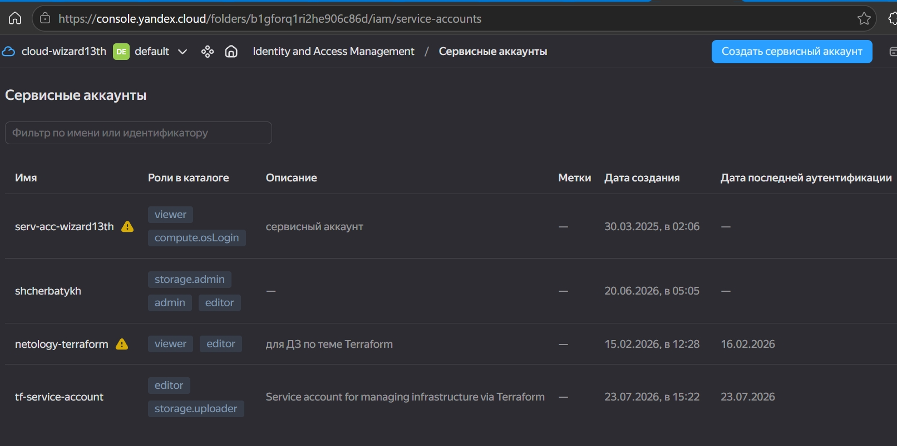
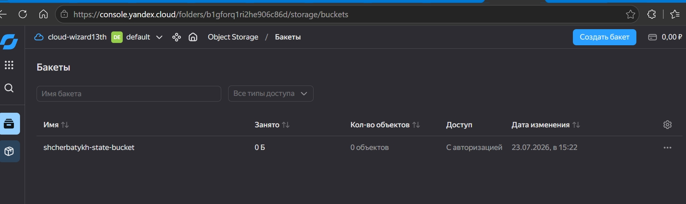
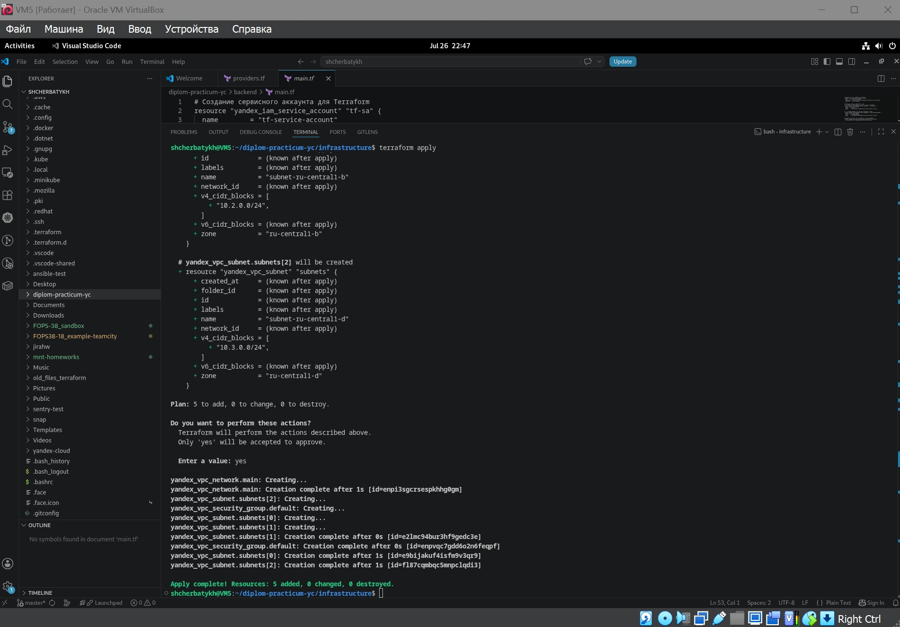
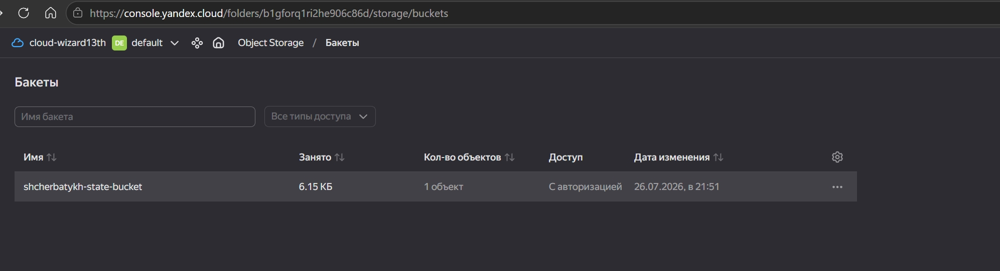
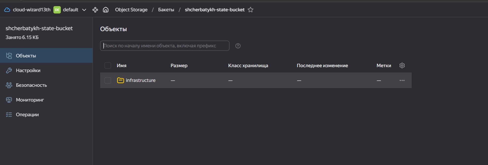
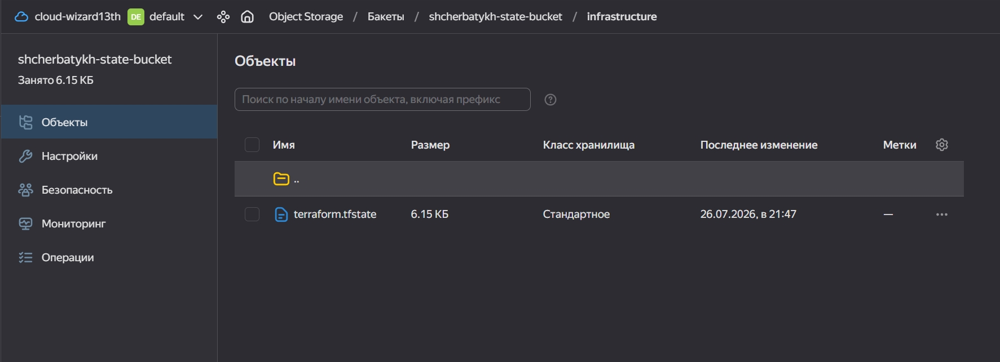
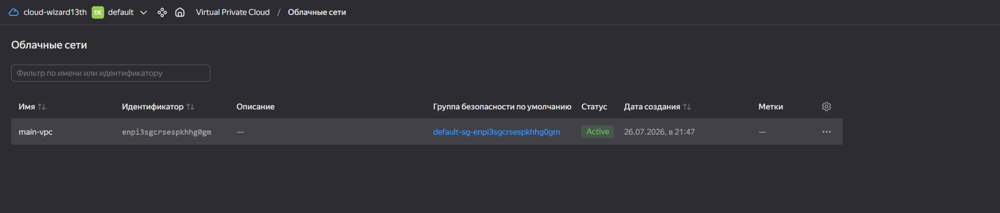
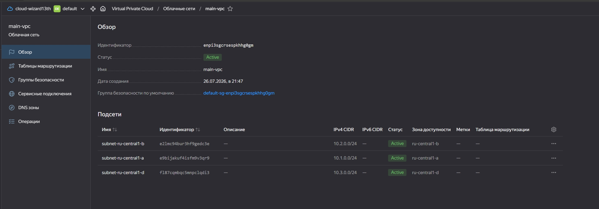
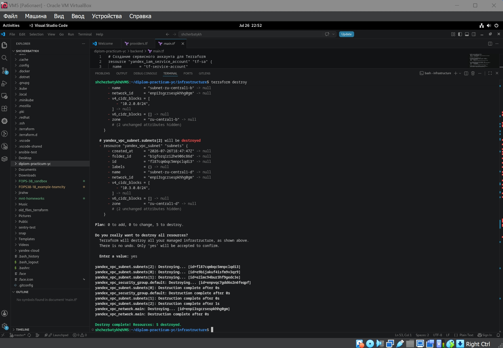
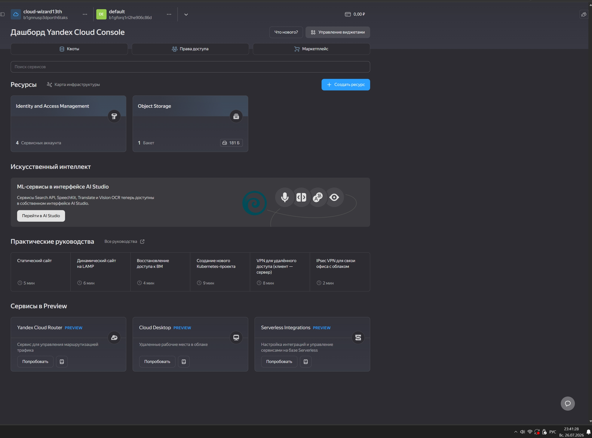

# Дипломный практикум в Yandex.Cloud (FOPS-38, Щербатых А.Е.)

---

# Цели:
1. Подготовить облачную инфраструктуру на базе облачного провайдера Яндекс.Облако.
2. Запустить и сконфигурировать Kubernetes кластер.
3. Установить и настроить систему мониторинга.
4. Настроить и автоматизировать сборку тестового приложения с использованием Docker-контейнеров.
5. Настроить CI для автоматической сборки и тестирования.
6. Настроить CD для автоматического развёртывания приложения.

---

## Этапы выполнения:
### Создание облачной инфраструктуры

Для начала необходимо подготовить облачную инфраструктуру в ЯО при помощи Terraform.

Особенности выполнения:

- Бюджет купона ограничен, что следует иметь в виду при проектировании инфраструктуры и использовании ресурсов; Для облачного k8s используйте региональный мастер(неотказоустойчивый). Для self-hosted k8s минимизируйте ресурсы ВМ и долю ЦПУ. В обоих вариантах используйте прерываемые ВМ для worker nodes.

Предварительная подготовка к установке и запуску Kubernetes кластера.

1. Создайте сервисный аккаунт, который будет в дальнейшем использоваться Terraform для работы с инфраструктурой с необходимыми и достаточными правами. Не стоит использовать права суперпользователя
2. Подготовьте backend для Terraform:

   а. Рекомендуемый вариант: S3 bucket в созданном ЯО аккаунте (создание бакета через TF)

   б. Альтернативный вариант: Terraform Cloud

3. Создайте конфигурацию Terrafrom, используя созданный бакет ранее как бекенд для хранения стейт файла. Конфигурации Terraform для создания сервисного аккаунта и бакета и основной инфраструктуры следует сохранить в разных папках.
4. Создайте VPC с подсетями в разных зонах доступности.
5. Убедитесь, что теперь вы можете выполнить команды terraform destroy и terraform apply без дополнительных ручных действий.
6. В случае использования Terraform Cloud в качестве backend убедитесь, что применение изменений успешно проходит, используя web-интерфейс Terraform cloud.

Ожидаемые результаты:

Terraform сконфигурирован и создание инфраструктуры посредством Terraform возможно без дополнительных ручных действий, стейт основной конфигурации сохраняется в бакете или Terraform Cloud.

Полученная конфигурация инфраструктуры является предварительной, поэтому в ходе дальнейшего выполнения задания возможны изменения.

---
### Облачная инфраструктура

Для удобства решил организовать файлы в две отдельные директории. Это позволит разделить управление служебными ресурсами (backend) и основной инфраструктурой (infrastructure). Полагаю, это упростит поддержку и переиспользование.

diplom-practicum-yc/

├── backend/           # Конфигурация для сервисного аккаунта и S3-бакета

│   ├── main.tf        # Создание сервисного аккаунта и S3-бакета

│   ├── variables.tf

│   └── providers.tf 

└── infrastructure/    # Основная конфигурация инфраструктуры
    ├── main.tf
    ├── variables.tf
    └── providers.tf   # Настройка провайдера и бекенда

На первом шаге выполнения задания создаю [сервисный аккаунт с минимальными правами и бакет Object Storage], где будет храниться state-файл основной инфраструктуры.

Сервисный аккаунт

S3-бакет

Теперь, когда [backend](https://github.com/Anton-Shcherbatykh/FOPS-38_diplom/blob/main/Files/backend/main.tf) создан, на следующем шаге приступаю к настройке основной [инфраструктуры](https://github.com/Anton-Shcherbatykh/FOPS-38_diplom/blob/main/Files/infrastructure/providers.tf), используя созданный бакет для хранения state-файла.

Проверяю работу команды terraform apply из папки infrastructure:

- убеждаюсь, что состояние бакета изменилось и в нём появился объект

- убеждаюсь, что в бакете Object Storage появилась папка infrastructure

- появился файл terraform.tfstate

Также проверяю созданные сеть и подсети в разных зонах доступности:

После того, как всё успешно создано, проверяю работу и результат выполнения команды terraform destroy:

Видно, что сеть и подсети удалены, файл состояния в бакете очищен (объём информации в нём уменьшен с Килобайт до двух сотен байт).
